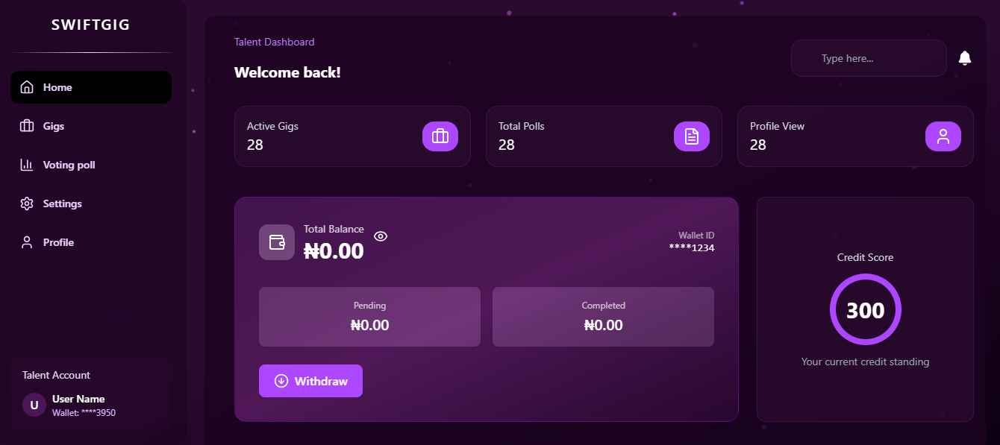
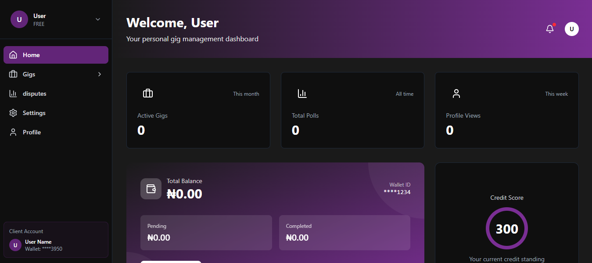

# SwiftGig

[](LICENSE)
[](https://github.com/Kars07/SwiftGig/issues)
[](https://github.com/Kars07/SwiftGig/stargazers)


**SwiftGig – Escrow Powered Freelance Platform**

SwiftGig is an open-source gig management application written in Swift. It is designed to help freelancers, gig workers, and project managers easily organize, track, and manage their gigs, tasks, and clients efficiently. Whether you are working solo or as part of a team, SwiftGig provides a robust platform to streamline your workflow and maximize productivity.

---

## 🚀 Features

- **Intuitive Dashboard**: Get a quick overview of your upcoming gigs, pending tasks, and client communications.
- **Gig Management**: Create, edit, and categorize gigs with status tracking (e.g., upcoming, in progress, completed).
- **Task Scheduling**: Add detailed tasks to each gig, set deadlines, and receive notifications.
- **Client Database**: Store and manage client information securely, including contact history and notes.
- **Analytics & Reports**: Visualize your productivity, earnings, and completed gigs over time.
- **Cross-Platform Support**: Optimized for both macOS and iOS devices.
- **Offline Access**: Work on your gigs and tasks even without an active internet connection.
- **Modern SwiftUI Interface**: Clean, fast, and responsive user experience leveraging the latest SwiftUI features.

---

## 🖼️ Screenshots





---

## 🚀 Key Features

### 🧑‍💻 Talent Dashboard
- Manage gigs, earnings, and job history in one place.  
- Submit proposals and communicate directly with clients.  
- View real-time analytics on job performance and ratings.  
- Withdraw funds instantly using **escrow-enabled payouts**.  
- Access a credit score that reflects reliability and performance.

### 🧑‍💼 Client Dashboard
- Post new gigs and track submissions easily.  
- Hire top-rated freelancers with transparent review systems.  
- Manage ongoing projects and milestone payments.  
- View spending insights and payment history.  
- Verify completed work through secure **escrow confirmation**.

---

## 💸 Instant Payout System

SwiftGig leverages **escrow technology** to provide **instant, secure, and transparent payments**.  
No more waiting days for withdrawals — once a job is approved, freelancers get paid **instantly** through the automated escrow release system.

---

## 🔗 Escrow-Powered Infrastructure

- Built on a secure escrow payment architecture for transparency and trust.  
- Escrow contracts handle funds and automatic payment releases.  
- Proof of transaction ensures confidence and eliminates disputes.

---

## 🛠️ Tech Stack

**Frontend:** React + Vite + TypeScript + Tailwind CSS  
**Backend:** Node.js + Express + MongoDB  
**Payment Layer:** Escrow system for secure & instant payout  
**Authentication:** JWT + OAuth + Email verification  

---

## 🌍 Vision

SwiftGig aims to empower the next generation of freelancers across Africa and beyond by providing a **trust-based, borderless, and inclusive gig economy**.  
It bridges the gap between talent and opportunity through **automation, transparency, and instant reward systems**.

---

## 🧩 Core Modules

| Module | Description |
|--------|--------------|
| 🧠 Auth System | Secure login, register, and email verification |
| 💼 Dashboard | Separate views for talents and clients |
| 💰 Wallet | Manage balance, view transactions, and withdraw instantly |
| 💸 Escrow System | Handles secure payments and auto-payouts |
| ⭐ Ratings & Reviews | Build credibility and trust between users |
| 📈 Analytics | Get insights into work history and earnings |

---

## 🧠 Future Roadmap

- 🌐 Multi-currency escrow support  
- 📱 Mobile app for Android and iOS  
- 🧾 AI-powered gig recommendations  
- 🛡️ Decentralized reputation scoring  

---

## 👥 Team

SwiftGig is developed by **a passionate team of developers and innovators** dedicated to building the future of work — secure, instant, and borderless.  
It is comprised of a team across multiple stacks: Frontend, Backend, Escrow System Developers, AI/ML, Product Design, Data Science, and Cybersecurity.

---

## 📜 License

This project is licensed under the **MIT License** — feel free to use, modify, and contribute.

---

### 💬 Connect with Us

If you'd like to collaborate or contribute, feel free to open an issue or reach out via GitHub discussions.

> **SwiftGig — Work Faster. Get Paid Instantly.**

---

## ⚙️ Installation

1. **Clone the repository:**
    ```bash
    git clone https://github.com/Kars07/SwiftGig.git
    cd SwiftGig
    ```

2. **Open the project in VS Code or any preferred editor:**
    ```bash
    cd swiftgig_frontend
    npm install
    ```

3. **After installing dependencies for frontend, do the same for backend:**
   ```bash
    cd swiftgig_backend
    npm install
    ```

4. **Run the Development Server:**
    ```bash
    npm run dev --Frontend
    node server.js --Backend
    ```

5. **Development Server should run:**
    ```bash
    http://localhost:5173/ --Frontend
    http://localhost:1010/ --Backend
    ```

6. **Check available routes in `swiftgig_frontend/src/App.tsx`:**
   ```bash
    Available routes:
    - /
    - /signup
    - /register/client
    - /register/talent
    - /client-auth
    - /talent-auth
    - /verify
    - /talent-dashboard
    - /client-dashboard
---

## Usage

- **Add a Gig**: Click the "Add Gig" button on the dashboard. Fill in details like title, client, deadline, and description.
- **Track Tasks**: Within a gig, add tasks, set priorities, and check them off as you go.
- **View Reports**: Navigate to the Analytics section to see your performance and earning trends.

---

## Roadmap

- [ ] Integration with popular calendar apps
- [ ] Cloud sync and backup
- [ ] Invoice generation and payment tracking
- [ ] Team collaboration features

---

## Contributing

Contributions are welcome!  
To contribute, please fork this repository and submit a pull request. For major changes, open an issue first to discuss what you would like to change.

1. Fork the Project
2. Create your Feature Branch (`git checkout -b feature/AmazingFeature`)
3. Commit your Changes (`git commit -m 'Add some AmazingFeature'`)
4. Push to the Branch (`git push origin feature/AmazingFeature`)
5. Open a Pull Request

See [CONTRIBUTING.md](CONTRIBUTING.md) for more details.

---

## License

Distributed under the MIT License. See [`LICENSE`](LICENSE) for more information.

---

## Contact

- **Author:** [Kars07](https://github.com/Kars07)
- **Project Link:** [https://github.com/Kars07/SwiftGig](https://github.com/Kars07/SwiftGig)
- **Issues & Feedback:** Please use the [issue tracker](https://github.com/Kars07/SwiftGig/issues).

---

## Acknowledgements

- SwiftGig
- All open-source contributors and the SwiftGig community